# Going Viral: Uncovering Key Drivers in Content Virality Through Data Analysis
## Introduction
In today’s world, social media plays a huge role in how we communicate, share ideas, and interact with content. Every day, certain posts suddenly gain massive attention and spread across social media platforms like TikTok, Instagram, Twitter, and YouTube. Our project explores this idea by figuring out what makes a social media post go viral by looking at engagement data across several platforms and building models that can help predict the virality of a post.

Our question focuses on what characteristics of a post are most associated with high engagement, and we can use those to predict whether a post will go viral or not. We are using a dataset from Kaggle called “Viral Social Media Trends & Engagement Analysis” to answer this question. It includes 5,000 social media posts and provides details like the platform being used, the hashtag used, the type of content, the region, and engagement metrics such as views, likes, shares, and comments. It also includes an engagement level of low, medium, or high.

This project explores the dataset to find patterns and trends that can help us answer the question. Our approach includes data cleaning, clustering posts to see which kinds tend to go viral. This project provides useful insights for content creators, marketers, and anyone looking to understand how viral posts work.
## Data
The dataset used for this project is “Viral Social Media Trends & Engagement Analysis” from Kaggle. It contains 5,000 unique entries representing posts from platforms such as TikTok, Instagram, Twitter, and YouTube. We chose this dataset because it includes key insights of viral social media posts, including user engagement and characteristics of the post, which help us answer our question.

Each row in the dataset contains one post and includes ten features: a postID, the platform it was posted on, the hashtag used, the content type (video, tweet, reel, or livestream), and the region where it was posted. Additionally, the dataset includes information about engagement metrics like views, likes, shares, and comments. Another useful column is the engagement level, which labels each post’s engagement as either low, medium, or high. This can help us train our models for classification. Looking at the dataset as a whole, YouTube was the most represented platform. The most common content types were livestreams and standard posts. The engagement levels were evenly distributed between low, medium, and high.

Overall, the dataset helps us explore what makes a post go viral. It includes data from many different platforms, content, and metrics that can aid when we look for patterns and relationships using classification and clustering techniques.

We will begin by importing our dataset and assigning it to the pandas Dataframe varible 'trends.' This allows for easy manipulation and analysis of the data. Then by running the function: head(), on our dataset we are able to get a sneak peak of what we are working with like noting missing values or inconvenient variable types.

## Data Visualizations for Data Understanding
<div>
<style scoped>
    .dataframe tbody tr th:only-of-type {
        vertical-align: middle;
    }

    .dataframe tbody tr th {
        vertical-align: top;
    }

    .dataframe thead th {
        text-align: right;
    }
</style>
<table border="1" class="dataframe">
  <thead>
    <tr style="text-align: right;">
      <th></th>
      <th>Post_ID</th>
      <th>Platform</th>
      <th>Hashtag</th>
      <th>Content_Type</th>
      <th>Region</th>
      <th>Views</th>
      <th>Likes</th>
      <th>Shares</th>
      <th>Comments</th>
      <th>Engagement_Level</th>
    </tr>
  </thead>
  <tbody>
    <tr>
      <th>0</th>
      <td>Post_1</td>
      <td>TikTok</td>
      <td>#Challenge</td>
      <td>Video</td>
      <td>UK</td>
      <td>4163464</td>
      <td>339431</td>
      <td>53135</td>
      <td>19346</td>
      <td>High</td>
    </tr>
    <tr>
      <th>1</th>
      <td>Post_2</td>
      <td>Instagram</td>
      <td>#Education</td>
      <td>Shorts</td>
      <td>India</td>
      <td>4155940</td>
      <td>215240</td>
      <td>65860</td>
      <td>27239</td>
      <td>Medium</td>
    </tr>
    <tr>
      <th>2</th>
      <td>Post_3</td>
      <td>Twitter</td>
      <td>#Challenge</td>
      <td>Video</td>
      <td>Brazil</td>
      <td>3666211</td>
      <td>327143</td>
      <td>39423</td>
      <td>36223</td>
      <td>Medium</td>
    </tr>
    <tr>
      <th>3</th>
      <td>Post_4</td>
      <td>YouTube</td>
      <td>#Education</td>
      <td>Shorts</td>
      <td>Australia</td>
      <td>917951</td>
      <td>127125</td>
      <td>11687</td>
      <td>36806</td>
      <td>Low</td>
    </tr>
    <tr>
      <th>4</th>
      <td>Post_5</td>
      <td>TikTok</td>
      <td>#Dance</td>
      <td>Post</td>
      <td>Brazil</td>
      <td>64866</td>
      <td>171361</td>
      <td>69581</td>
      <td>6376</td>
      <td>Medium</td>
    </tr>
  </tbody>
</table>
</div>

### Visualization 1: Distribution of posts across different platforms


### Visualization 2: Distribution of engagement levels


### Visualization 3: Average views, likes, shares, and comments by platform

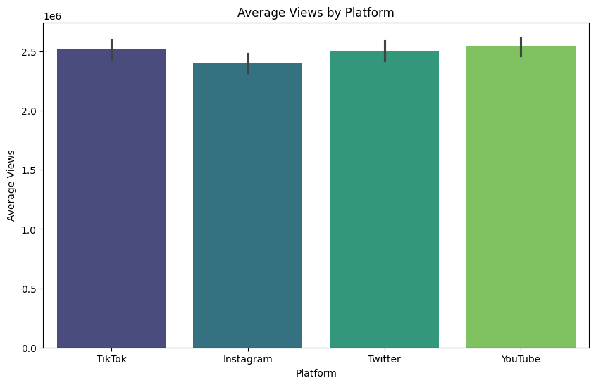

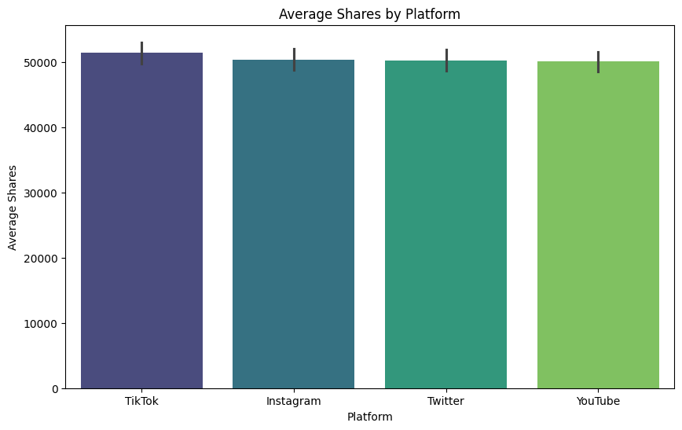
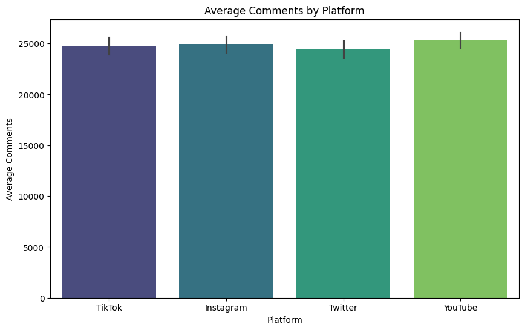

### Visualization 4: Average views, likes, shares, and comments by engagement level


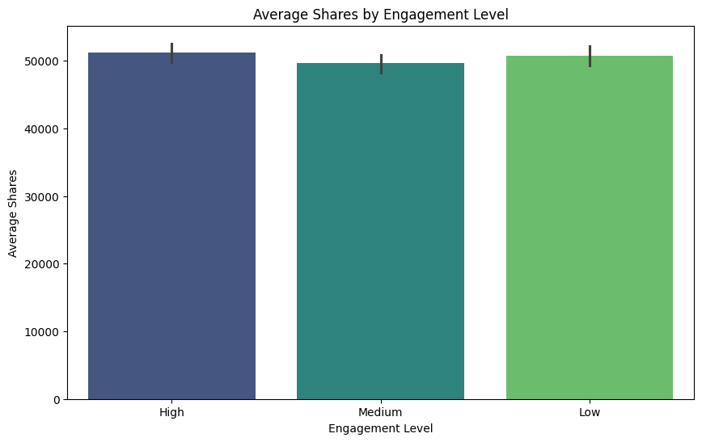
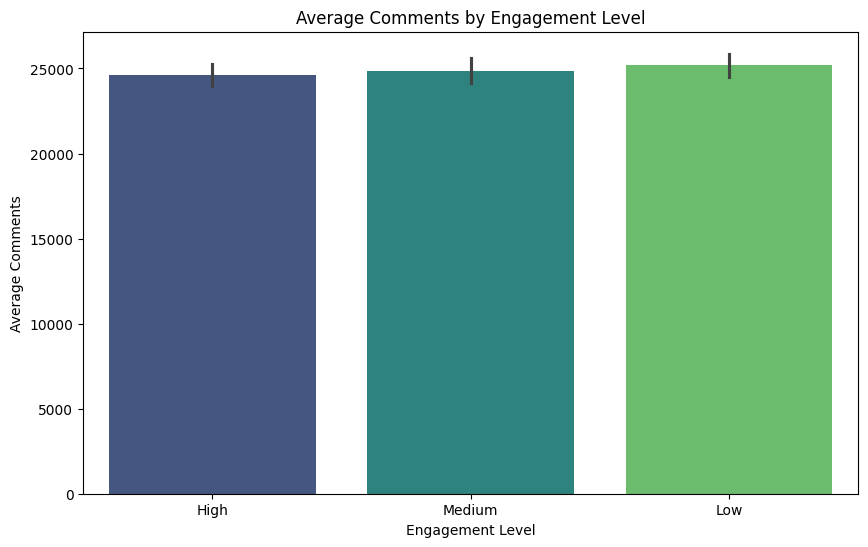


### Visualization 5: Correlation heatmap of engagement metrics


## Pre-Processing
```<class 'pandas.core.frame.DataFrame'>
RangeIndex: 5000 entries, 0 to 4999
Data columns (total 10 columns):
 #   Column            Non-Null Count  Dtype 
---  ------            --------------  ----- 
 0   Post_ID           5000 non-null   object
 1   Platform          5000 non-null   object
 2   Hashtag           5000 non-null   object
 3   Content_Type      5000 non-null   object
 4   Region            5000 non-null   object
 5   Views             5000 non-null   int64 
 6   Likes             5000 non-null   int64 
 7   Shares            5000 non-null   int64 
 8   Comments          5000 non-null   int64 
 9   Engagement_Level  5000 non-null   object
dtypes: int64(4), object(6)
memory usage: 390.8+ KB 
```

Before using our data within our models, we need to transform features that may have null or categorical values. From running the info() function, we can see that our data set has no missing values and four numerical columns. The other 6 columns are categorical.

Below, we will using Onee-Hot encoding to turn our categorical values into multiple binary columns. We do this since our model cannot process these directly so one-hot encoding helps translate them. We also drop the column 'Post_ID' because it does not carry any meaningful information for predicting engagement. Finally, we converted our target column from text ('High', 'Medium', and 'low') to numerical values (2,1,0).

Once we completed these pre-processing steps, our dataset has expanded from 10 columns to 29. This way our model can now identify the different values without misunderstanding the data.

## Modeling: Classification Predicting Engagement Level
Before we run our model, we will prepare our data by separating the features from the target variable. Specifically, we dropped the 'Engagement_Level' column from the dataset to create our feature matrix 'x' and store our target label in 'y'. After splitting the data into training and testing sets, using an 80-20 split. Additionally, by setting the random state to 42 we make sure that the split is reproducible.

We will use a Random Forest Classifier which is a method that builds multiple decision tress and merges them to get a more accurate prediction.

## Feature Importance and New Feature Engineering
To gain more insights, we examined the feature importance provided by the Random Forest model. We found that the top 5 most important features were

- Likes
- Shares
- Views
- Comments

Taking this into account, we predict that engagement might be better captured not just by individual counts but by how interactions relate to the views of a post.

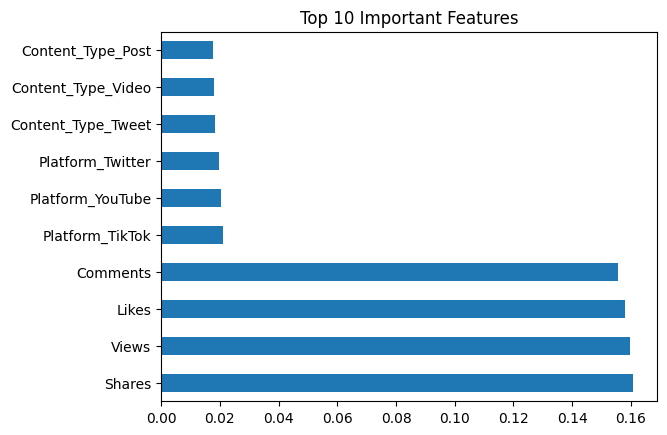


## Decision Tree
Decision trees serve as a popular choice for classification and interpretability. For this project, we chose this model because it would work well in the classification of a post into categories, but also picks the best features that helps the post have the highest engagement features. We overall saw the views, shares, comments, and likes contributed most to engagement level.

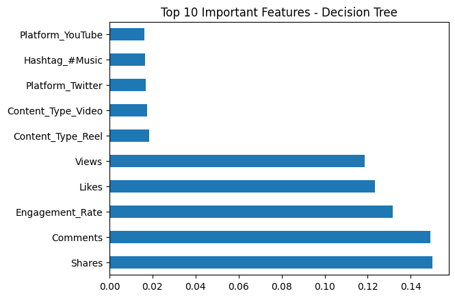

## Feature Importance: Insights from the Decision Tree
After evaluating the results from the decision tree results it seems that these fields contributed the most:

Views: Higher view counts generally correlate with increased engagement, reflecting broader reach and exposure.
Shares: Posts with more shares tend to have higher engagement, indicating active user participation in spreading content.
Comments: Increased comments signify direct interaction and discussion around a post, contributing to higher engagement.
Likes: Increases likes of the post seemed to contribute to higher engagement.
These findings emphasize the importance of creating content that attracts views, encourages sharing, and fosters active discussions to maximize social media engagement.
## KNN Classification
Nearest Neighbors (KNN) was chosen for this classification task because it is simple, easy to interpret, and effective as a baseline model. KNN does not assume any specific data distribution and can naturally handle multiclass classification problems like engagement levels.

<style>#sk-container-id-1 {
  /* Definition of color scheme common for light and dark mode */
  --sklearn-color-text: #000;
  --sklearn-color-text-muted: #666;
  --sklearn-color-line: gray;
  /* Definition of color scheme for unfitted estimators */
  --sklearn-color-unfitted-level-0: #fff5e6;
  --sklearn-color-unfitted-level-1: #f6e4d2;
  --sklearn-color-unfitted-level-2: #ffe0b3;
  --sklearn-color-unfitted-level-3: chocolate;
  /* Definition of color scheme for fitted estimators */
  --sklearn-color-fitted-level-0: #f0f8ff;
  --sklearn-color-fitted-level-1: #d4ebff;
  --sklearn-color-fitted-level-2: #b3dbfd;
  --sklearn-color-fitted-level-3: cornflowerblue;

  /* Specific color for light theme */
  --sklearn-color-text-on-default-background: var(--sg-text-color, var(--theme-code-foreground, var(--jp-content-font-color1, black)));
  --sklearn-color-background: var(--sg-background-color, var(--theme-background, var(--jp-layout-color0, white)));
  --sklearn-color-border-box: var(--sg-text-color, var(--theme-code-foreground, var(--jp-content-font-color1, black)));
  --sklearn-color-icon: #696969;

  @media (prefers-color-scheme: dark) {
    /* Redefinition of color scheme for dark theme */
    --sklearn-color-text-on-default-background: var(--sg-text-color, var(--theme-code-foreground, var(--jp-content-font-color1, white)));
    --sklearn-color-background: var(--sg-background-color, var(--theme-background, var(--jp-layout-color0, #111)));
    --sklearn-color-border-box: var(--sg-text-color, var(--theme-code-foreground, var(--jp-content-font-color1, white)));
    --sklearn-color-icon: #878787;
  }
}

#sk-container-id-1 {
  color: var(--sklearn-color-text);
}

#sk-container-id-1 pre {
  padding: 0;
}

#sk-container-id-1 input.sk-hidden--visually {
  border: 0;
  clip: rect(1px 1px 1px 1px);
  clip: rect(1px, 1px, 1px, 1px);
  height: 1px;
  margin: -1px;
  overflow: hidden;
  padding: 0;
  position: absolute;
  width: 1px;
}

#sk-container-id-1 div.sk-dashed-wrapped {
  border: 1px dashed var(--sklearn-color-line);
  margin: 0 0.4em 0.5em 0.4em;
  box-sizing: border-box;
  padding-bottom: 0.4em;
  background-color: var(--sklearn-color-background);
}

#sk-container-id-1 div.sk-container {
  /* jupyter's `normalize.less` sets `[hidden] { display: none; }`
     but bootstrap.min.css set `[hidden] { display: none !important; }`
     so we also need the `!important` here to be able to override the
     default hidden behavior on the sphinx rendered scikit-learn.org.
     See: https://github.com/scikit-learn/scikit-learn/issues/21755 */
  display: inline-block !important;
  position: relative;
}

#sk-container-id-1 div.sk-text-repr-fallback {
  display: none;
}

div.sk-parallel-item,
div.sk-serial,
div.sk-item {
  /* draw centered vertical line to link estimators */
  background-image: linear-gradient(var(--sklearn-color-text-on-default-background), var(--sklearn-color-text-on-default-background));
  background-size: 2px 100%;
  background-repeat: no-repeat;
  background-position: center center;
}

/* Parallel-specific style estimator block */

#sk-container-id-1 div.sk-parallel-item::after {
  content: "";
  width: 100%;
  border-bottom: 2px solid var(--sklearn-color-text-on-default-background);
  flex-grow: 1;
}

#sk-container-id-1 div.sk-parallel {
  display: flex;
  align-items: stretch;
  justify-content: center;
  background-color: var(--sklearn-color-background);
  position: relative;
}

#sk-container-id-1 div.sk-parallel-item {
  display: flex;
  flex-direction: column;
}

#sk-container-id-1 div.sk-parallel-item:first-child::after {
  align-self: flex-end;
  width: 50%;
}

#sk-container-id-1 div.sk-parallel-item:last-child::after {
  align-self: flex-start;
  width: 50%;
}

#sk-container-id-1 div.sk-parallel-item:only-child::after {
  width: 0;
}

/* Serial-specific style estimator block */

#sk-container-id-1 div.sk-serial {
  display: flex;
  flex-direction: column;
  align-items: center;
  background-color: var(--sklearn-color-background);
  padding-right: 1em;
  padding-left: 1em;
}


/* Toggleable style: style used for estimator/Pipeline/ColumnTransformer box that is
clickable and can be expanded/collapsed.
- Pipeline and ColumnTransformer use this feature and define the default style
- Estimators will overwrite some part of the style using the `sk-estimator` class
*/

/* Pipeline and ColumnTransformer style (default) */

#sk-container-id-1 div.sk-toggleable {
  /* Default theme specific background. It is overwritten whether we have a
  specific estimator or a Pipeline/ColumnTransformer */
  background-color: var(--sklearn-color-background);
}

/* Toggleable label */
#sk-container-id-1 label.sk-toggleable__label {
  cursor: pointer;
  display: flex;
  width: 100%;
  margin-bottom: 0;
  padding: 0.5em;
  box-sizing: border-box;
  text-align: center;
  align-items: start;
  justify-content: space-between;
  gap: 0.5em;
}

#sk-container-id-1 label.sk-toggleable__label .caption {
  font-size: 0.6rem;
  font-weight: lighter;
  color: var(--sklearn-color-text-muted);
}

#sk-container-id-1 label.sk-toggleable__label-arrow:before {
  /* Arrow on the left of the label */
  content: "▸";
  float: left;
  margin-right: 0.25em;
  color: var(--sklearn-color-icon);
}

#sk-container-id-1 label.sk-toggleable__label-arrow:hover:before {
  color: var(--sklearn-color-text);
}

/* Toggleable content - dropdown */

#sk-container-id-1 div.sk-toggleable__content {
  max-height: 0;
  max-width: 0;
  overflow: hidden;
  text-align: left;
  /* unfitted */
  background-color: var(--sklearn-color-unfitted-level-0);
}

#sk-container-id-1 div.sk-toggleable__content.fitted {
  /* fitted */
  background-color: var(--sklearn-color-fitted-level-0);
}

#sk-container-id-1 div.sk-toggleable__content pre {
  margin: 0.2em;
  border-radius: 0.25em;
  color: var(--sklearn-color-text);
  /* unfitted */
  background-color: var(--sklearn-color-unfitted-level-0);
}

#sk-container-id-1 div.sk-toggleable__content.fitted pre {
  /* unfitted */
  background-color: var(--sklearn-color-fitted-level-0);
}

#sk-container-id-1 input.sk-toggleable__control:checked~div.sk-toggleable__content {
  /* Expand drop-down */
  max-height: 200px;
  max-width: 100%;
  overflow: auto;
}

#sk-container-id-1 input.sk-toggleable__control:checked~label.sk-toggleable__label-arrow:before {
  content: "▾";
}

/* Pipeline/ColumnTransformer-specific style */

#sk-container-id-1 div.sk-label input.sk-toggleable__control:checked~label.sk-toggleable__label {
  color: var(--sklearn-color-text);
  background-color: var(--sklearn-color-unfitted-level-2);
}

#sk-container-id-1 div.sk-label.fitted input.sk-toggleable__control:checked~label.sk-toggleable__label {
  background-color: var(--sklearn-color-fitted-level-2);
}

/* Estimator-specific style */

/* Colorize estimator box */
#sk-container-id-1 div.sk-estimator input.sk-toggleable__control:checked~label.sk-toggleable__label {
  /* unfitted */
  background-color: var(--sklearn-color-unfitted-level-2);
}

#sk-container-id-1 div.sk-estimator.fitted input.sk-toggleable__control:checked~label.sk-toggleable__label {
  /* fitted */
  background-color: var(--sklearn-color-fitted-level-2);
}

#sk-container-id-1 div.sk-label label.sk-toggleable__label,
#sk-container-id-1 div.sk-label label {
  /* The background is the default theme color */
  color: var(--sklearn-color-text-on-default-background);
}

/* On hover, darken the color of the background */
#sk-container-id-1 div.sk-label:hover label.sk-toggleable__label {
  color: var(--sklearn-color-text);
  background-color: var(--sklearn-color-unfitted-level-2);
}

/* Label box, darken color on hover, fitted */
#sk-container-id-1 div.sk-label.fitted:hover label.sk-toggleable__label.fitted {
  color: var(--sklearn-color-text);
  background-color: var(--sklearn-color-fitted-level-2);
}

/* Estimator label */

#sk-container-id-1 div.sk-label label {
  font-family: monospace;
  font-weight: bold;
  display: inline-block;
  line-height: 1.2em;
}

#sk-container-id-1 div.sk-label-container {
  text-align: center;
}

/* Estimator-specific */
#sk-container-id-1 div.sk-estimator {
  font-family: monospace;
  border: 1px dotted var(--sklearn-color-border-box);
  border-radius: 0.25em;
  box-sizing: border-box;
  margin-bottom: 0.5em;
  /* unfitted */
  background-color: var(--sklearn-color-unfitted-level-0);
}

#sk-container-id-1 div.sk-estimator.fitted {
  /* fitted */
  background-color: var(--sklearn-color-fitted-level-0);
}

/* on hover */
#sk-container-id-1 div.sk-estimator:hover {
  /* unfitted */
  background-color: var(--sklearn-color-unfitted-level-2);
}

#sk-container-id-1 div.sk-estimator.fitted:hover {
  /* fitted */
  background-color: var(--sklearn-color-fitted-level-2);
}

/* Specification for estimator info (e.g. "i" and "?") */

/* Common style for "i" and "?" */

.sk-estimator-doc-link,
a:link.sk-estimator-doc-link,
a:visited.sk-estimator-doc-link {
  float: right;
  font-size: smaller;
  line-height: 1em;
  font-family: monospace;
  background-color: var(--sklearn-color-background);
  border-radius: 1em;
  height: 1em;
  width: 1em;
  text-decoration: none !important;
  margin-left: 0.5em;
  text-align: center;
  /* unfitted */
  border: var(--sklearn-color-unfitted-level-1) 1pt solid;
  color: var(--sklearn-color-unfitted-level-1);
}

.sk-estimator-doc-link.fitted,
a:link.sk-estimator-doc-link.fitted,
a:visited.sk-estimator-doc-link.fitted {
  /* fitted */
  border: var(--sklearn-color-fitted-level-1) 1pt solid;
  color: var(--sklearn-color-fitted-level-1);
}

/* On hover */
div.sk-estimator:hover .sk-estimator-doc-link:hover,
.sk-estimator-doc-link:hover,
div.sk-label-container:hover .sk-estimator-doc-link:hover,
.sk-estimator-doc-link:hover {
  /* unfitted */
  background-color: var(--sklearn-color-unfitted-level-3);
  color: var(--sklearn-color-background);
  text-decoration: none;
}

div.sk-estimator.fitted:hover .sk-estimator-doc-link.fitted:hover,
.sk-estimator-doc-link.fitted:hover,
div.sk-label-container:hover .sk-estimator-doc-link.fitted:hover,
.sk-estimator-doc-link.fitted:hover {
  /* fitted */
  background-color: var(--sklearn-color-fitted-level-3);
  color: var(--sklearn-color-background);
  text-decoration: none;
}

/* Span, style for the box shown on hovering the info icon */
.sk-estimator-doc-link span {
  display: none;
  z-index: 9999;
  position: relative;
  font-weight: normal;
  right: .2ex;
  padding: .5ex;
  margin: .5ex;
  width: min-content;
  min-width: 20ex;
  max-width: 50ex;
  color: var(--sklearn-color-text);
  box-shadow: 2pt 2pt 4pt #999;
  /* unfitted */
  background: var(--sklearn-color-unfitted-level-0);
  border: .5pt solid var(--sklearn-color-unfitted-level-3);
}

.sk-estimator-doc-link.fitted span {
  /* fitted */
  background: var(--sklearn-color-fitted-level-0);
  border: var(--sklearn-color-fitted-level-3);
}

.sk-estimator-doc-link:hover span {
  display: block;
}

/* "?"-specific style due to the `<a>` HTML tag */

#sk-container-id-1 a.estimator_doc_link {
  float: right;
  font-size: 1rem;
  line-height: 1em;
  font-family: monospace;
  background-color: var(--sklearn-color-background);
  border-radius: 1rem;
  height: 1rem;
  width: 1rem;
  text-decoration: none;
  /* unfitted */
  color: var(--sklearn-color-unfitted-level-1);
  border: var(--sklearn-color-unfitted-level-1) 1pt solid;
}

#sk-container-id-1 a.estimator_doc_link.fitted {
  /* fitted */
  border: var(--sklearn-color-fitted-level-1) 1pt solid;
  color: var(--sklearn-color-fitted-level-1);
}

/* On hover */
#sk-container-id-1 a.estimator_doc_link:hover {
  /* unfitted */
  background-color: var(--sklearn-color-unfitted-level-3);
  color: var(--sklearn-color-background);
  text-decoration: none;
}

#sk-container-id-1 a.estimator_doc_link.fitted:hover {
  /* fitted */
  background-color: var(--sklearn-color-fitted-level-3);
}
</style><div id="sk-container-id-1" class="sk-top-container"><div class="sk-text-repr-fallback"><pre>KNeighborsClassifier()</pre><b>In a Jupyter environment, please rerun this cell to show the HTML representation or trust the notebook. <br />On GitHub, the HTML representation is unable to render, please try loading this page with nbviewer.org.</b></div><div class="sk-container" hidden><div class="sk-item"><div class="sk-estimator fitted sk-toggleable"><input class="sk-toggleable__control sk-hidden--visually" id="sk-estimator-id-1" type="checkbox" checked><label for="sk-estimator-id-1" class="sk-toggleable__label fitted sk-toggleable__label-arrow"><div><div>KNeighborsClassifier</div></div><div><a class="sk-estimator-doc-link fitted" rel="noreferrer" target="_blank" href="https://scikit-learn.org/1.6/modules/generated/sklearn.neighbors.KNeighborsClassifier.html">?<span>Documentation for KNeighborsClassifier</span></a><span class="sk-estimator-doc-link fitted">i<span>Fitted</span></span></div></label><div class="sk-toggleable__content fitted"><pre>KNeighborsClassifier()</pre></div> </div></div></div></div>

## Evaluation
To evaluate our models’ performance in classifying post engagement levels (low, medium, high), we used common classification metrics: accuracy, precision, recall, and F1-score. Our goal was to identify patterns in social media posts that could help predict virality, so we focused on how well our models could classify each engagement level rather than just overall accuracy.
## The Random Forest Classifier

```Accuracy: 0.354```

To evaluate the model's performace we will use accuracy as the metric. This model produced an accuracy between 3.19 and 3.33 depending on the run. This indicates that it performed slightly better then random guessing but still has a lot of room for improvement.

To analyze the results a bit more, we will use a confusion matrix. The rows correspond to the true labels and the columns correspond to the predicted labels. Ideally, we want high numbers on the diagonal (correct predictions) and low numbers elsewhere.

In this following matrix, we can see the model struggles to correctly classify the engagement levels. Since the misclassifications are fequent acress all classes, this suggests that the classes are diffcult for the model to distinguish based on the original features.

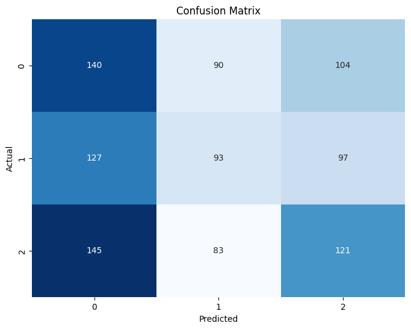

## Random Forest-Post Feature Engineering

```Accuracy Score: 0.314```

After creating 'Engagement_Rate' feature and retraining the random forest model using the same process, the resulting accuracy improved slightly from an initial range of 0.319-0.33 to a new range of 0.32-0.36.

Although the improvement was small, this suggests that the new engagement_rate feature helped the model capture some additional information that individual features alone did not fully express.

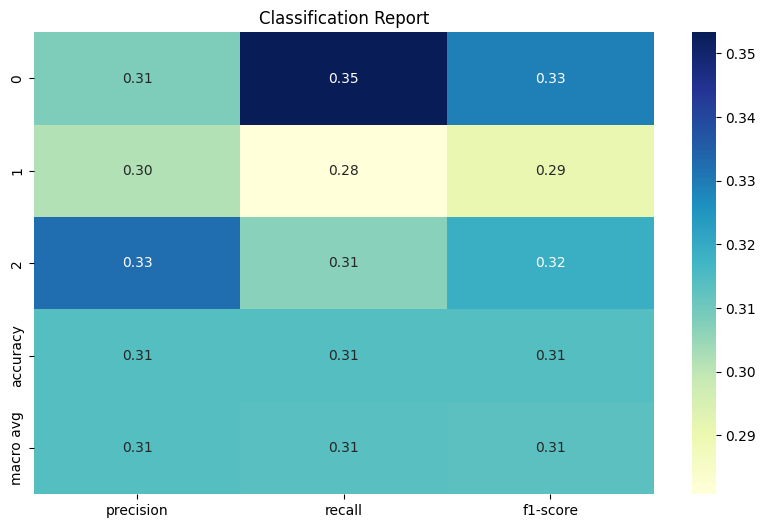
## Decsion Tree

```Decision Tree Accuracy: 0.325```

The accuracy of the decision tree showed to be around `0.321` since this is a multifacited classification this would be a better score than guessing.
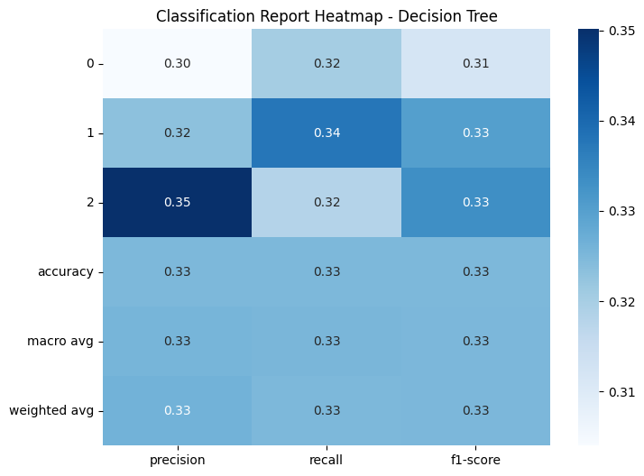
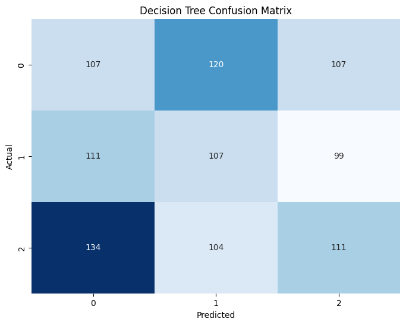

## KNN 
After training the model with k=5 neighbors, it achieved an accuracy of approximately 0.307. This relatively low score suggests that the features used may not strongly predict engagement, and improvements like feature scaling, hyperparameter tuning, or adding more neighbors.

```Accuracy score: 0.307```

To better understand how the choice of k affects model performance, we plotted the accuracy of the K-Nearest Neighbors (KNN) classifier for different values of k ranging from 1 to 20. The graph shows that accuracy fluctuates across different k values, but generally trends upward as k increases. Lower k values tend to result in more variance and slightly lower accuracy, while higher k values produce more stable and higher accuracy scores, peaking around k = 20 with an accuracy slightly above 34%. This suggests that for this dataset, using a higher number of neighbors leads to better generalization, although overall accuracy remains relatively modest.


The classification report represents key performance metrics of the KNN helping understand the effectiveness of predicting Engagement Level.

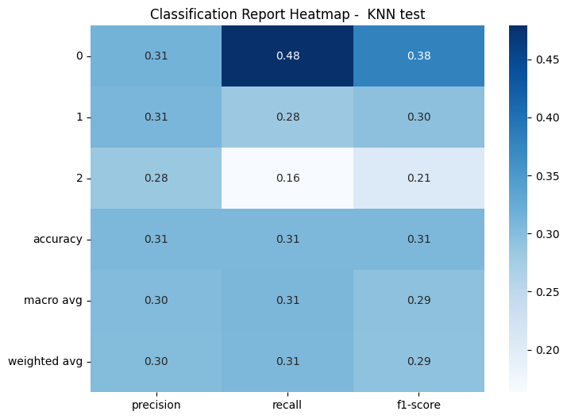

The next portion is the evaluation of the confusion matrix, which is a 2x2 table that represents the Actual Label compared to the Predicted Label. As previously mentioned in the report, the model correctly identifies high risk individuals well, however, classifies many low-risk individuals as high risk.


## Model Comparison
This bar chart compares the performance of the Random Forest and Decision Tree models across four evaluation metrics: Accuracy, Precision, Recall, and F1-score. Both models achieved very similar results across all metrics, with Random Forest slightly outperforming Decision Tree in each category. This suggests that while both models handle the classification task comparably, Random Forest provides a small but consistent improvement in predictive performance, likely due to its ability to reduce overfitting by averaging multiple decision trees.
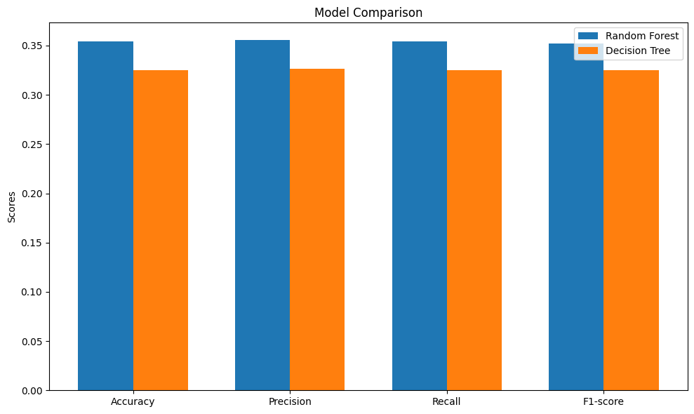

## Overview
The random forrest classifer consistently performed best across metrics, with an accuracy score reaching up to 0.36 after feature engineering. Introducing a new feature, Engagement_Rate (calculated as the sum of likes, shares, and comments divided by views), slightly improved performance, suggesting it helped capture information that individual features missed.

Here’s a breakdown of results:

### Random Forest (post-feature engineering):

```Accuracy: ~0.333–0.36```

Strength: Captured complex feature interactions and minimized overfitting

Weakness: Still struggled to accurately classify medium and high engagement posts

### Decision Tree:

```Accuracy: ~0.325```

Strength: Easy to interpret and revealed key features like views, shares, comments, and likes

Weakness: Lower overall performance, more prone to overfitting

### K-Nearest Neighbors (k=5):

```Accuracy: ~0.307```

Strength: Simple and good baseline

Weakness: Sensitive to k value; didn’t perform well with noisy or unscaled data

The confusion matrices and classification reports revealed that all models struggled to distinguish between medium and high engagement levels, likely due to overlapping characteristics. In contrast, low engagement posts were easier to classify correctly.

Answering our original question: “Can we predict whether a social media post will be highly engaging based on its metrics?”, our models suggest partial predictability. Engagement is influenced by more than just quantitative metrics, factors like content type, timing, and platform trends (which weren’t available in our dataset) also likely play a major role.

Future improvements could include:

- Applying feature scaling (especially for KNN)

- Using ensemble models or gradient boosting

- Collecting more diverse data, including text or image features from the posts
## Conclusion
This project gave us a deeper understanding of what makes social media posts go viral, but it also showed how difficult it is to predict virality. We found that engagement metrics like likes, shares, comments, and views play a big role in determining how well a post performs. However, we struggled to accurately predict posts with medium or high engagement, even with different models like Random Forest, Decision Tree, and K-Nearest Neighbors. Random Forest gave us the best results, though the accuracy wasn’t super high, which showed that working with data on viral trends is tricky. We also learned that adding features like ‘Engagement_Rate’ helped improve our model slightly, proving that good feature engineering is key. While we gained some useful insights, predicting virality is still really hard due to the many unpredictable factors that influence trends. Having more data or adding factors like timing or influencer status might help us improve predictions.
## Storytelling
During the course of this project, we examined various factors to analyze the underlying patterns in viral trends across social media platforms, including Twitter and Instagram. Our group focused on post engagement, content type, and timing to uncover the key factors that contribute to a trend going viral. We aimed to develop a model that accurately predicts whether a post will go viral, helping content creators and marketers optimize their strategies. Our primary question was: What characteristics of a post are most strongly associated with high engagement, and can we predict whether a post will go viral based on these factors? To address this, we conducted classification and clustering analyses to understand the underlying patterns in the data.

Using classification techniques, we achieved an accuracy score of approximately 32.9% with a Random Forest Classifier. While modest, this score slightly outperformed the Decision Tree Classifier, which achieved an accuracy of 32.1%. Random Forest outperformed Decision Tree by approximately 0.8%, showing that ensemble methods and smarter feature engineering can lead to more reliable predictions — even when working with highly chaotic data like viral trends.

The relatively low overall accuracy reflects the inherent complexity and randomness of social media virality. Factors such as algorithm behavior, pop culture moments, trending topics, world events, and user behavior patterns all play critical roles — variables that are difficult to capture through basic post features alone. Although our model was able to learn some patterns (particularly distinguishing low-engagement posts), it struggled to reliably differentiate between medium and high engagement levels. This indicates that future modeling efforts would benefit from richer feature engineering — such as including sentiment analysis, posting time, influencer status, and trending hashtag usage — to better capture the nuanced realities of viral success.

Examining the confusion matrix for the Random Forest model, we observed that it correctly predicted Low Engagement posts more consistently than other categories. However, there was still significant confusion between Medium and High Engagement levels, with the model often misclassifying Medium posts as either Low or High, and vice versa. This suggests that while Low Engagement posts are easier to identify, Medium and High posts have more overlapping features, making them harder to separate.

In comparison, the Decision Tree confusion matrix showed heavier confusion across all engagement levels, particularly mistaking High Engagement posts as Low. While both models struggled to clearly separate Medium and High Engagement posts, Random Forest achieved more reliable and stable performance overall, reaffirming its advantage as a more robust and effective classifier.

An analysis of feature importance for both models revealed that shares, likes, comments, and views were the most influential factors in predicting engagement levels, while content type and platform had significantly less impact. This highlights that direct user interactions are more critical to a post's success than the medium or platform where it is posted. Notably, both models identified shares as the single most important feature, reinforcing the idea that active user participation in promoting content significantly drives engagement.

To improve the model's predictive performance, we engineered a new variable called ‘Engagement_Rate’, capturing the proportion of likes, shares, and comments relative to views. By introducing this normalized measure of post interaction, the model was able to slightly improve its performance, demonstrating the importance of thoughtful feature engineering when working with engagement data.

We also explored the K-Nearest Neighbors (KNN) algorithm, adjusting k-values from 1 to 20 to find the best fit. At low k-values (1–5), KNN exhibited chaotic behavior — accuracy swung wildly around 30–32%, showing the dangers of trusting too few neighbors. It was like predicting viral trends by asking a handful of random people. As k increased beyond 14, KNN stabilized, with accuracy climbing toward 34% at k=20. Larger k-values helped the model smooth out noise and find better patterns. However, even at its peak, KNN couldn’t outperform Random Forest. This experience taught us that proximity alone isn't enough — predicting virality requires understanding broader patterns like momentum, timing, and culture, not just surface-level similarity.

In the end, while the K-Nearest Neighbors (KNN) algorithm improved with more neighbors, ensemble models proved to be the stronger and more reliable choice for navigating the unpredictable waves of social media. The features most associated with high engagement include shares, likes, comments, and views for both models. Predicting whether a post will go viral is partially achievable, especially for low-engagement posts. However, further analysis on predicting medium and high engagement was challenging due to the random and complex nature of virality.

## Impact
The impact of this project is that it offers meaningful insights into the patterns and features that drive the virality of various social media posts. Identifying which post characteristics, such as content types and hashtags, are linked to higher or lower engagement can guide social media creators to optimize their content for maximum engagement, which can be a great tool for influencers and promotional marketers. The findings can also shed light on what makes posts go viral across different social media platforms, so we can decipher the different trends that may be going on in each. However, the data available may encourage the manipulation of content just purely for engagement purposes, which can lead to a spread of low-quality or misleading content. Heavily focusing on our algorithms' predictions for creating content may also reduce the authenticity and creativity of content online that we truly appreciate. Balancing data-driven insights with ethical and inspired content creation can mitigate these risks and help encourage this data to be used in a positive light to help creators and marketers manage engagement for their content on their platforms in our fast-moving digital landscape.


